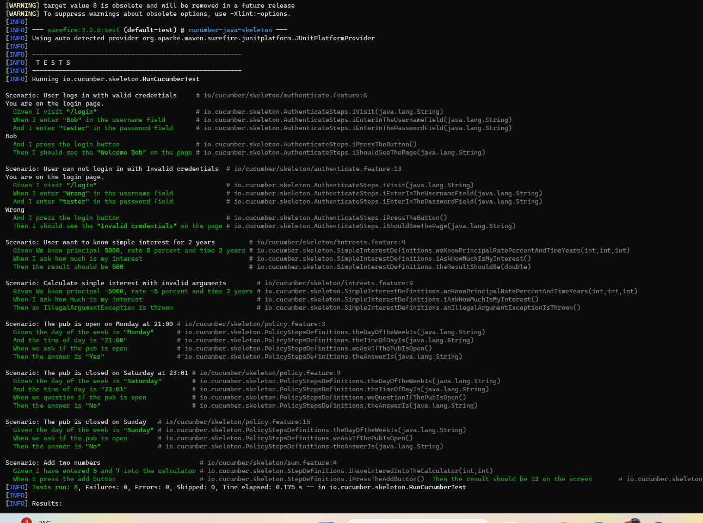

# DAT251_BDD
This repository contains lab for running `Cucumber` using `Java`. 
If you are taking this course, you should be familiar with the concept of `BDD`, `User stories` and `Cucumber`.

# Prerequisites

1. Make sure you have `jdk` installed. Verify by running `java -version` from your command line.
```
PS C:\Users\itsme\OneDrive\Documents\Projects\bdd> java -version
java version "21.0.2" 2024-01-16 LTS
Java(TM) SE Runtime Environment (build 21.0.2+13-LTS-58)
Java HotSpot(TM) 64-Bit Server VM (build 21.0.2+13-LTS-58, mixed mode, sharing)
```
If you do not get this output, make sure you install Java. Just google it. Or follow the official site https://www.oracle.com/java/technologies/downloads/. 

Make sure you have `JAVA_HOME` in your environment variable.

2. Make sure you have `Maven` installed. Verify by running `mvn -version` from your command line. 

```
PS C:\Users\itsme\OneDrive\Documents\Projects\bdd> mvn -version
Apache Maven 3.9.6 (bc0240f3c744dd6b6ec2920b3cd08dcc295161ae)
Maven home: C:\Program Files\apache-maven-3.9.6
Java version: 21.0.2, vendor: Oracle Corporation, runtime: C:\Program Files\Java\jdk-21
Default locale: en_US, platform encoding: UTF-8
OS name: "windows 11", version: "10.0", arch: "amd64", family: "windows"
```
If you get output as above, you are good to go to the next step. If not, google how to install Apache Maven on your computer. This guide can help you as well https://www.geeksforgeeks.org/how-to-install-apache-maven-on-windows/.

Make sure you have `MAVEN_HOME` in your environment variable. 

3. Clone this repository. 

```gitexclude
git clone https://github.com/sureshHARDIYA/DAT251_BDD.git
```

4. Go inside the repository and run clean installation. 

```
cd DAT251_BDD
mvn clean install 
mvn test
```
Provided you followed the instruction clearly, you should see the result given below.

